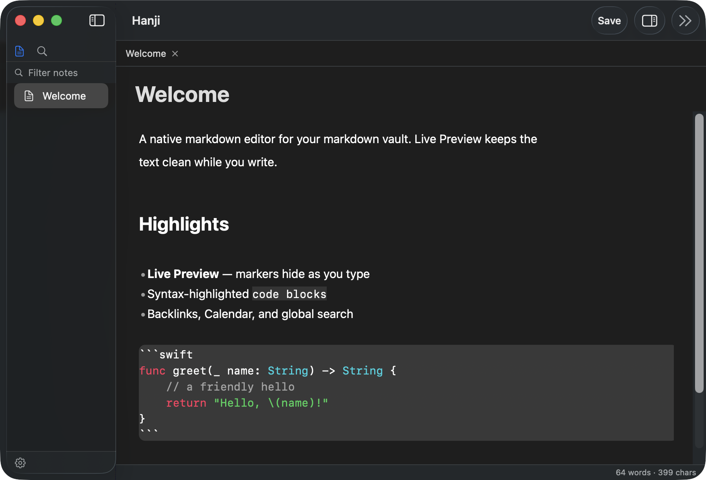
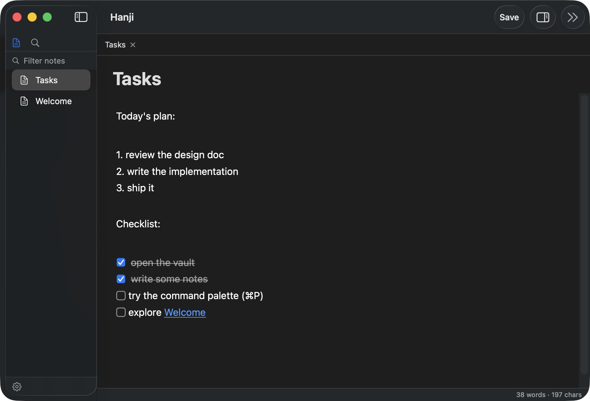

# Hanji.md

A native macOS markdown editor that opens your **markdown vaults** — built with
SwiftUI + TextKit 2, with a Swift extension SDK. Local-first, fast, no account.

> *Hanji* (한지) is Korean mulberry paper — documents written on it last a
> thousand years. A folder of plain `.md` files is the same bet: the notes
> outlive whatever app happened to edit them.




## Why

A folder of plain `.md` files is a great, portable store for notes — no database,
no lock-in, the files are the source of truth. Hanji is a **native** editor
for that kind of vault: a TextKit 2 engine with incremental Live Preview, and an
extension model written in **Swift** rather than JS. It reads the vault config
already sitting in your folder (periodic notes, templates) instead of asking you
to set everything up again.

## Features

**Editing (Live Preview)**
- Caret-aware Live Preview: headings, bold, italic, inline code, links &
  wikilinks, blockquotes, callouts, frontmatter — markers reveal on the line
  you're editing.
- Rendered bullets (`•`) and clickable task checkboxes (☐ / ☑).
- Bullet, task, and **numbered** lists continue on Return (numbers increment);
  Return on an empty item leaves the list, and Tab / ⇧Tab nests and un-nests it.
- Fenced code blocks render as a full-width slab with **syntax highlighting**
  (Swift, JS/TS, Python, JSON, shell + a C-like fallback).
- Inline images, **mermaid** diagrams, and horizontal rules render in place.
- Editable inline file title; clicking a `[[wikilink]]` or `[text](note.md)`
  opens the target note.
- **Find & replace in the note** (⌘F, ⌘G / ⇧⌘G, ⌥⌘F) using AppKit's find bar.
- **Autosave** (debounced, off the main thread) with external-edit **conflict
  detection** and a non-modal reload / keep-mine banner; ⌘S saves on demand.

**Workspace**
- **Tabs and split panes**: drag to reorder, drop a tab on either edge to split.
- Full file tree: sort, multi-select, drag-and-drop, rename, trash, undo, import.
- **Command palette (⌘P)**, **quick switcher (⌘O)**, **global search (⇧⌘F)** over
  a persistent SQLite FTS5 index (Korean-friendly trigram tokenizer).
- **Vault-wide find & replace (⌥⇧⌘F)**: literal match with a case toggle, a
  confirmation that states how many occurrences in how many notes, and one
  **⌥⌘Z** that reverts the entire batch.
- **Backlinks** and **Calendar** side panels (collapsible, ⌥⌘B).
- Settings: editor font size, recent vaults, and **live plugin toggles**.

**Plugins / SDK (compile-time, Swift)**
- First-party: **Periodic Notes**, **Templater**, **Backlinks**, **Calendar**,
  Word Count — all built on the same `ExtensionSDK` third parties would use.
- **Dataview-lite**: `LIST` / `TABLE` with `FROM #tag` / `"folder"`, `WHERE`,
  `SORT`, frontmatter fields, and `file.name` / `file.mtime` built-ins.
- SDK surfaces: ① code-block renderers, ② metadata queries (backlinks / index
  updates), ③ commands + sidebar, and workspace note actions.

**Vault compatibility** — opens existing markdown vaults; reads the
`periodic-notes` config (folder, date format, template); renders `<% tp.* %>`
Templater syntax (core date/file functions).



## Build & run

```sh
swift run hanji                              # run from SPM
./Scripts/bundle-app.sh && open Hanji.app    # build & launch a .app bundle
swift run Checks                             # run the test suite
```

**Command Line Tools is sufficient** to build and run — full Xcode is only needed
for XCTest, Instruments, and code-signing. Minimum target: **macOS 14**; building
needs a **Swift 6.1+** toolchain (Xcode 16.3+ / matching Command Line Tools),
because GRDB 7 declares `swift-tools-version:6.1`.

### Installing the app

There is no signed/notarized release yet, so the supported path is **building
from source** (above). A `.app` you build locally runs fine; a `.app` copied to
another Mac would be blocked by Gatekeeper until the project ships notarized
builds (planned). The only external dependency is
[GRDB](https://github.com/groue/GRDB.swift) for the search index.

## Architecture

```
HanjiApp (exe) → { AppCore, EditorEngine, CoreRenderers, first-party plugins }
AppCore        → { VaultKit, ExtensionSDK, MarkdownCore, MKSearchKit }
EditorEngine   → { MarkdownCore, ExtensionSDK }
MKSearchKit    → GRDB           (the only module that imports GRDB)
Plugins        → ExtensionSDK   (+ pure libs like TemplateKit) — never AppCore/the app
```

Pure, dependency-free logic lives in `MarkdownCore` / `TemplateKit` and is fully
covered by `swift run Checks` (a zero-dependency runner — Command Line Tools ship
no XCTest). See [`CONTRIBUTING.md`](CONTRIBUTING.md) and the design records in
[`docs/`](docs/).

## Status & known gaps

Pre-1.0 and under active development. Working toward an open-source v0.1.

- **Not built yet**: export / print, a separate reading (rendered-only) mode,
  and an outline / table-of-contents panel.
- **Move Tab Left/Right (⌃⌘←/→) collides with macOS Spaces switching** if you
  have that enabled in System Settings ▸ Keyboard. Use the File menu items, or
  rebind Spaces.
- Vault-wide replace is literal only — no regex, and no per-occurrence review;
  it replaces every match at once (⌥⌘Z reverts the whole batch).
- A few interactions (link-click navigation, checkbox toggle) are verified by
  logic/tests but were hard to exercise with synthetic input during development
  — please report anything off.
- Performance/correctness debt being tracked: async search for very large
  vaults; a `field(path)` / `tag(path)` index for big Dataview sets; a one-time
  full-vault read on vault open for iCloud vaults; `Tags.extract` should skip
  fenced code blocks. Contributions welcome — see CONTRIBUTING.

## License

[MIT](LICENSE) © 2026 MartianLee
